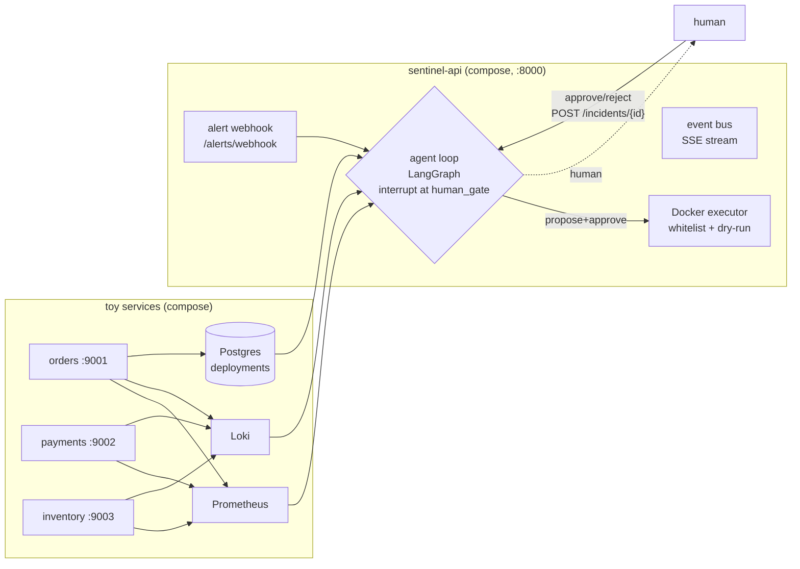

# Sentinel — Agentic Incident Triage Assistant (SRE Copilot)

*Status: Phase 8 — docs & polish.* Sentinel is a self-contained demo of an SRE copilot that turns an
alert into a human-approvable remediation: it gathers evidence (Loki/Prometheus/Postgres), reasons
about a root cause, proposes a whitelisted action, pauses for a human decision, then executes and
re-verifies. See `PLAN.md` for the authoritative implementation plan + Working Protocol.

## Architecture



The flow: an alert hits the webhook → the graph gathers evidence → reasons → proposes a remediation
→ **pauses** at `human_gate` (`interrupt()`, D6) → a human approves via the API → the executor runs
the (dry-run-first) action → verification re-checks the alerting metric → the report reflects the
actual outcome.

## Local model note

The plan names `qwen2.5:7b-instruct` as the local model. On this machine the configured local model
is **`phi4-mini`** (Ollama). All references to the local model use `phi4-mini`; recorded as an
environment note in the Phase 0 report.

## WSL2 + Docker setup

- **Repo location (D17 / LEARN[02]):** work on the repo at `~/dev2/Sentinel` on the **WSL2 native
  filesystem** (ext4 inside the WSL2 VM), **not** `/mnt/c/...`. `/mnt/c` is served via the 9P file
  protocol, so uv/pytest/ruff do thousands of slow cross-VM syscalls; it also brings CRLF and
  executable-bit breakage that breaks pre-commit hooks and shell scripts. Edit via your editor's
  **WSL remote mode** so it operates on the Linux filesystem.
- **Docker Desktop** with WSL2 integration enabled; run compose commands from inside the WSL2 shell.
- **Ollama (local LLM, optional):** run it bound to all interfaces — `OLLAMA_HOST=0.0.0.0 ollama
  serve` — then `ollama pull phi4-mini` (first run downloads the model; the plan's target is
  `qwen2.5:7b-instruct`). The API container reaches the host-side Ollama via
  `host.docker.internal:11434` (see `extra_hosts` in compose, D4/LEARN[06]).

## LLM setup (dual-provider smoke test)

`scripts/smoke_llm.py` drives the same `structured_call` loop (D1) against the configured provider;
the provider/model/endpoint are config, not code (D3/D14). Copy the right block into `.env`
(gitignored), then run the matching command. Secrets live in `.env` — see `.env.example` for the
full variable reference.

**Naming convention (LEARN[03]):** every config var is prefixed `SENTINEL_` so it never collides with
an unrelated daemon, and nested keys are joined with `__` (double underscore) — so
`SENTINEL_LLM__MODEL` sets `llm.model` and `SENTINEL_DATABASE__URL` sets `database.url`. Only
`LLM_PROVIDER` is an unprefixed convenience passthrough: the config preprocessor maps it onto
`llm.provider` and it always wins, so you flip cloud/local without touching `config.yaml`.

**Cloud (OpenAI-compatible endpoint, e.g. DeepSeek):**

```dotenv
LLM_PROVIDER=openai
SENTINEL_LLM__MODEL=deepseek-v4-flash
SENTINEL_LLM__BASE_URL=https://api.deepseek.com
SENTINEL_LLM__API_KEY_ENV=DEEPSEEK_API_KEY   # *name* of the env var that holds the real key
DEEPSEEK_API_KEY=sk-...                       # real key lives in .env, never committed
```

```bash
uv run python scripts/smoke_llm.py --provider openai
```

**Local (Ollama):**

```dotenv
LLM_PROVIDER=ollama
SENTINEL_LLM__MODEL=phi4-mini
SENTINEL_LLM__BASE_URL=http://localhost:11434/v1            # host (CLI / demo / scripts)
# The API *container* must reach the host-side Ollama instead (D4 / LEARN[06]):
#   SENTINEL_LLM__BASE_URL=http://host.docker.internal:11434/v1
SENTINEL_LLM__API_KEY_ENV=OPENAI_API_KEY   # name only; Ollama ignores the key's value
SENTINEL_LLM__TEMPERATURE=0.0
```

```bash
OLLAMA_HOST=0.0.0.0 ollama serve
ollama pull phi4-mini     # first run downloads the model (plan target: qwen2.5:7b-instruct)
uv run python scripts/smoke_llm.py --provider ollama
```

`SENTINEL_LLM__API_KEY_ENV` is a **name**, never a value: the provider factory (`factory.py`) reads
the actual key from whatever env var that name points to via `os.environ`, so the repo stores no
credential. Ollama's OpenAI-compatible server ignores the key but still needs an `Authorization`
header, so the factory always supplies a token (placeholder locally, real key for cloud).

## Quickstart

From a clean checkout (inside WSL2):

```
docker compose -f deploy/docker-compose.yaml --profile api up -d --build
uv run sentinel ingest-runbooks     # embed the runbook corpus (first run downloads the model)
uv run sentinel demo                # inject a fault, investigate, approve, stream to terminal
```

Health gate: `curl -s -o /dev/null -w "%{http_code}\n" http://localhost:8000/health` → `200`.

## Demo walkthrough

`uv run sentinel demo` is the one-command run: it health-checks the stack, injects `bad_deploy` on
`orders`, fires the alert, opens the SSE watch stream, pauses at the approval prompt (`Approve?
[y/n]`), and on `y` approves → executes → verifies → prints the final report. Watch the node-by-node
trace with `uv run sentinel incidents watch <id>` (tail the SSE stream), or inspect the result with
`uv run sentinel incidents show <id>`.

### Container config (env + URLs)

The API container gets its secrets + host-vs-container URLs from `deploy/docker-compose.yaml`:

- **Secret (never committed):** `env_file: ../.env` injects the repo-root `.env` (gitignored) into the
  container so the LLM key reaches the API. Compose's own `.env` auto-loading is for var
  **substitution** only and does *not* ship vars into the container — without `env_file:` the API
  builds a keyless client and crashes with `Missing credentials`.
- **URL resolution (D4):** the CLI/demo runs on the **host** (`localhost`/`900x`, API `localhost:8000`);
  the **container** reaches the same services by their compose names (`postgres:5432`, `loki:3100`,
  `prometheus:9090`). The LLM defaults to a public OpenAI-compatible endpoint; for local Ollama the
  container `base_url` must be `http://host.docker.internal:11434/v1` (see `extra_hosts`, LEARN[06]).

### CLI operations

- `uv run sentinel incidents list` — list incidents (optionally `--status`).
- `uv run sentinel incidents show <id>` — incident + ordered agent trace + graph state.
- `uv run sentinel incidents approve <id>` / `reject <id>` — resume a pending approval (D6).
- `uv run sentinel incidents watch <id>` — tail the SSE stream of node-by-node updates live.
- `uv run sentinel evals run --mode mock|live` — 8-incident eval (see Eval).
- `uv run sentinel ingest-runbooks` — embed the runbook corpus (Task 2.3).

## Runbook ingestion (RAG)

`uv run sentinel ingest-runbooks` chunks the `runbooks/` corpus, embeds each with a local
`all-MiniLM-L6-v2` model, and upserts into the `runbooks` table (idempotent by content hash). The
model downloads **on first ingest** into `./.cache` (gitignored).

## Eval (Phase 7)

`uv run sentinel evals run --mode mock|live` runs the 8-incident dataset (`evals/dataset/*.yaml`)
through the graph with canned tool outputs. `mock` is deterministic (100% — a self-test of the
harness); `live` uses the configured LLM. Measured `live` (structural scoring; threshold ≥75%):

| Model | Runs (overall) | Passed ≥75% |
|-------|----------------|-------------|
| deepseek-v4-flash (baseline) | 38%, 75%, 62%, 38% | 1 / 4 |
| deepseek-v4-pro             | 62%, 75%, 75%    | 2 / 3 |

Both DeepSeek models run in **thinking** mode (they return `reasoning_content`), which ignores the
`temperature` knob — `temperature=0.0` does not force determinism, so live results vary run-to-run
(see **L8**).

## Known limitations

Pre-declared scope cuts and known weaknesses are tracked in
[`KNOWN_LIMITATIONS.md`](KNOWN_LIMITATIONS.md) (user-visible items summarized below). Review markers
(`TODO(review)`) are enforced live by the pre-commit protocol checker.

- **L1 – Chaos suite scope:** only container/process faults; no network/disk-fill in v1.
- **L2 – Demo-only security posture:** unauthenticated API endpoints + a mounted Docker socket.
- **L3 – Single-tenant / single process:** concurrent investigations are serialized.
- **L4 – Fixed-window verification:** no statistical confirmation / auto-rollback on flap.
- **L5 – Grafana optional:** only behind a compose profile, no provisioned dashboards.
- **L7 – Partial scale emulation:** `scale_replicas` restarts replicas if present, else
  `not_applicable`.
- **L8 – Live-eval reliability:** with the available DeepSeek reasoning model, `live` eval does not
  reliably reach the ≥75% threshold (thinking mode ignores `temperature`); the `mock` run is the
  proven plumbing. The live threshold is not lowered silently (see the eval table above).

## Design decisions (condensed)

- **D1** Structured output: uniform JSON → extract → Pydantic-validate → repair loop (max 2).
- **D2** Embeddings: local `all-MiniLM-L6-v2` (384-dim) in both LLM modes; fixed pgvector schema.
- **D3** LLM client: one `ChatOpenAI` for cloud and Ollama (`/v1`).
- **D4** Ollama on the host; containers reach it via `host.docker.internal:11434`.
- **D5** Checkpointing: `PostgresSaver` pool, `thread_id = str(incident.id)`.
- **D6** HITL: LangGraph `interrupt()` + `Command(resume=...)`; resume via the API.
- **D7** DB migrations: Alembic for the app schema; checkpoint tables by `setup()`.
- **D8** Deploy-event logging: toy services write directly to the shared Postgres.
- **D9** Loki/Prometheus clients: plain `httpx` + `tenacity`.
- **D10** Streaming: SSE via `sse-starlette`, fed by an in-process event bus (also → `agent_events`).
- **D11** Executor: Docker SDK + whitelist (code + config), `dry_run` default true.
- **D12** CLI: `typer` + `rich`, entry point `sentinel`.
- **D13** Evals: `mock` (deterministic, 100%) + `live` (≥75%).
- **D14** Config: `pydantic-settings` (`config.yaml` base + `SENTINEL_*` env overrides).
- **D15** Verification: wait + re-query up to `attempts` times; escalate on persistent breach.
- **D16** Observability: Prometheus scrape interval 5s.
- **D17** Repo location: WSL2 native filesystem; per-task commits + per-phase tags; protocol checker
  is a load-bearing pre-commit hook.
